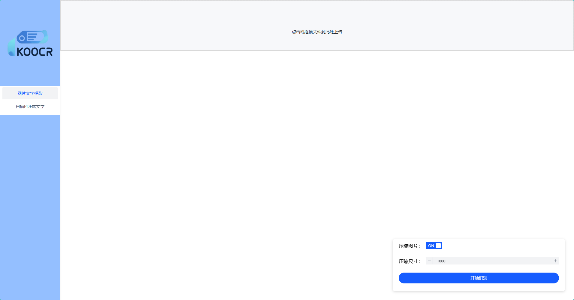

# 引言

**功能：** 一个用于图片OCR识别的web应用

**技术栈：**

- 语言: python(后端)、Vue3+JavaScript(前端)
- JavaScript运行时环境: Nodejs
- 包管理: pip、npm
- 代码托管/团队协作: git/github
- 部署工具: docker

**效果图：**




# KOOCR

1. 安装依赖(ubuntu22)

```bash
sudo apt install nodejs npm
# nvm node管理器安装
curl -o- https://gitee.com/RubyMetric/nvm-cn/raw/main/install.sh | bash
chmod +x ~./.nvm/nvm.sh
source ~/.bashrc
# 升级node为v17.9.1
nvm install v17.9.1
# 切换淘宝镜像源
vim ~/.npmrc
# 修改registry字段
https://registry.npmmirror.com
# 安装python依赖
sudo apt install python-is-python3
sudo apt install python3-pip
sudo apt-get install libjpeg-dev
pip install -r requirements.txt
# 更换pip源
mkdir -p ~/.pip
vim ~/.pip/pip.conf
# 添加如下内容
[global]
index-url = https://pypi.tuna.tsinghua.edu.cn/simple
```

2. 前端安装依赖

```bash
npm install
```

3. 运行前端

```bash
npm run serve
```

4. 构建前端部署到后端

```bash
npm run build
```

5. 在后端添加uploads文件夹

```bash
mkdir backend/uploads
```

6. 运行后端和前端

```bash
python backend/main.py
```

## 使用docker构建镜像并在容器中运行

1. 构建镜像：

```bash
docker build -t koocr-app .
```

2. 运行docker容器

```bash
docker run -p 8089:8089 --name koocr-container koocr-app
```

## 参考

https://github.com/alisen39/TrWebOCR
